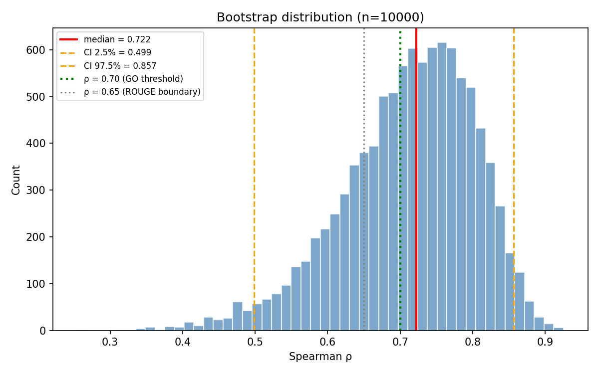
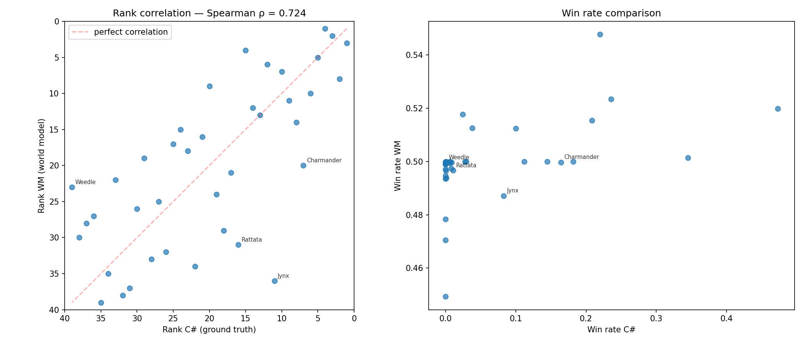

# Étape 3b — Correlation Report: WM vs C# Rankings (Hygiène)

## Résultat

| Métrique | Valeur |
|----------|--------|
| Spearman ρ | **0.724** |
| p-value | 1.9e-07 |
| Cartes alignées | 39 |
| Seuil go/no-go | ρ > 0.7 |
| **Décision (point)** | **GO** |

## Bootstrap CI (Check 2)

| Métrique | Valeur |
|----------|--------|
| Bootstrap median | **0.722** |
| CI 95% lower | 0.499 |
| CI 95% upper | 0.857 |
| **Zone** | **GRISE** |
| **Action** | v3.11 + re-run B=4096 |

## Timeout stats (Check 5)

| Métrique | Valeur |
|----------|--------|
| Timeout rate global | 1.0% |
| Garde-fou (> 30%) | OK |

## Scatter plot

## Top 10 comparison

| Rank | C# (ground truth) | WR C# | WM (world model) | WR WM |
|------|--------------------|--------|-------------------|-------|
| 1 | Farfetch'd | 0.473 | Zapdos | 0.548 |
| 2 | Hitmonchan | 0.345 | Chansey | 0.523 |
| 3 | Chansey | 0.236 | Farfetch'd | 0.520 |
| 4 | Zapdos | 0.220 | Onix | 0.518 |
| 5 | Electabuzz | 0.209 | Electabuzz | 0.515 |
| 6 | Nidoran ♂ | 0.182 | Pikachu | 0.513 |
| 7 | Charmander | 0.164 | Magnemite | 0.512 |
| 8 | Machop | 0.145 | Hitmonchan | 0.501 |
| 9 | Magmar | 0.112 | Tangela | 0.500 |
| 10 | Magnemite | 0.100 | Nidoran ♂ | 0.500 |

## Outliers (|rank diff| >= 13)

| Carte | Rank C# | Rank WM | Diff | WR C# | WR WM |
|-------|---------|---------|------|--------|-------|
| Jynx | 11 | 36 | -25 | 0.0829 | 0.487 |
| Weedle | 39 | 23 | +16 | 0.0000 | 0.500 |
| Rattata | 16 | 31 | -15 | 0.0108 | 0.497 |
| Charmander | 7 | 20 | -13 | 0.1641 | 0.500 |

## Analyse

**ZONE GRISE** (0.65 ≤ CI_upper < 0.70 ET CI_lower < 0.70). Le WM est probablement le bottleneck, mais le bruit contribue.

**Décision : v3.11 + re-run B=4096** — lancer v3.11 en parallèle d'un run B=4096 pour trancher.
